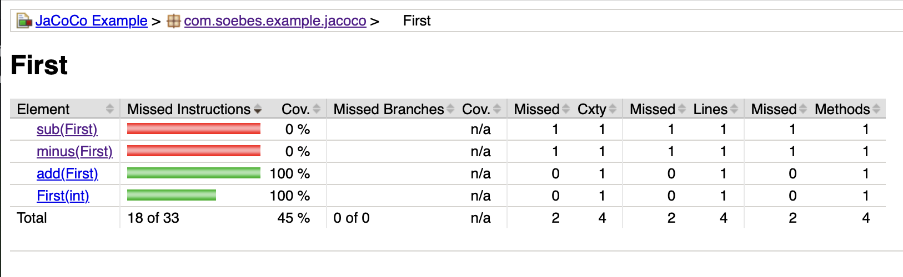
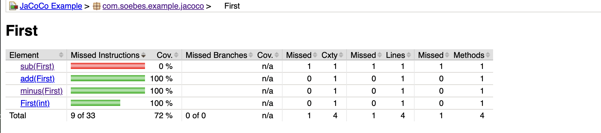

# Overview
In general having a number of unit- and integration tests in your project (BTW: I hope you have a larger number of tests)
is a good thing. Afterwards the question arises: Are those tests enough? Have I covered all possible cases? Now the idea 
of code coverage comes into my mind. That is a way to check which paths, branches and methods (more accurately:
[function coverage, statement coverage, branch coverage](https://en.wikipedia.org/wiki/Code_coverage)) etc. have been executed during the tests. That means in 
other words the higher the rate of coverage is, the more unlikely it is having issues. Or more accurately having issues 
during the change of code. Yes, some people yell here and say a test does not proof bug free software. Absolutely 
correct. On the other hand it helps to keep the functionality in your code as it is, even if you change your code 
(internal implementation, adding new features etc.). So you are not breaking existing functionality (breaking things 
like that is often called [regression](https://en.wikipedia.org/wiki/Regression_testing)).

Based on that, the final question arises: What should be the rate of your coverage? 30%, 50%, 80% or even 100%. Based on
experience, I would say 30% is too low and 100% is a bit strange (in such a case you might even test setter's and
getter's which does not really makes sense; this means testing the JDK) even if you could reach that level, you
seem to be focusing on making the code coverage tool happy. The important part here is to deeply think about your 
tests and whether what's in your application, is the real critical part. So my practical advice would be ca. 80%. 
(Yes others might have a different opinion).

The tool to measure code coverage in Java is [JaCoCo](https://www.jacoco.org/jacoco/), but that is not the only one. There
are existing things like [OpenClover](https://openclover.org/) or in Kotlin things like [Kover](https://github.com/Kotlin/kotlinx-kover)
and so on (just to mention some).

I will use here [JaCoCo](https://www.jacoco.org/jacoco/), where also the [JaCoCo-Maven-Plugin](https://www.jacoco.org/jacoco/trunk/doc/maven.html) exists for the usage in your Maven builds.
This article will show how to configure the code coverage to finally get the results for unit- and integration-tests.

## Example Project
Let's start with an example project which has the general structure like this:
```
src
|-- main
|   `-- java
|       `-- com
|           `-- soebes
|               `-- example
|                   `-- jacoco
|                       `-- First.java
`-- test
    `-- java
        `-- com
            `-- soebes
                `-- example
                    `-- jacoco
                        |-- FirstIT.java
                        `-- FirstTest.java
```
You might already have identified the unit test class based on the naming convention. I strongly recommend
to follow that naming convention in any Maven projects. In this example there is a single one `FirstTest.java`. 
Furthermore, we have an integration test `FirstIT.java`. This is a [usual directory structure][usual-directory-structure] 
of a Maven project. Also, not to forget, we have to have a `pom.xml` file, which contains the configuration for the 
project.

## Plugin Definition
We should take a look into the configuration for the project and see, which parts are necessary to configure JaCoCo code
coverage within the project. In general, you should define all used plugins within your Maven build to keep your build 
reproducible. The first thing is to define the `jacoco-maven-plugin` including its version and groupId. The ellipses `...`
represent other plugins, which should be defined, but currently are omitted for brevity. Furthermore, the 
[maven-surefire-plugin][maven-surefire-plugin] and [maven-failsafe-plugin][maven-failsafe-plugin] are required, 
because the unit tests are executed by the [maven-surefire-plugin][maven-surefire-plugin] while the integration tests are
executed by the [maven-failsafe-plugin][maven-failsafe-plugin].

```xml
<project...>
  ...
  <build>
    <pluginManagement>
      <plugins>
        <plugin>
          <groupId>org.jacoco</groupId>
          <artifactId>jacoco-maven-plugin</artifactId>
          <version>0.8.11</version>
        </plugin>
        ...
        <plugin>
          <groupId>org.apache.maven.plugins</groupId>
          <artifactId>maven-surefire-plugin</artifactId>
          <version>3.1.2</version>
          <configuration>
            <skipTests>${skipUTs}</skipTests>
          </configuration>
        </plugin>
        <plugin>
          <groupId>org.apache.maven.plugins</groupId>
          <artifactId>maven-failsafe-plugin</artifactId>
          <version>3.1.2</version>
          <configuration>
            <skipTests>${skipITs}</skipTests>
          </configuration>
        </plugin>
      </plugins>
    </pluginManagement>
    ...
  </build>
  ...
</project...>
```
So basically we define the versions via `pluginManagement` and the global configuration. The next thing you need 
to configure is the `jacoco-maven-plugin`. In general jacoco works by using agents, which must be executed during the 
build. That can be accomplished by using the `prepare-agent` goal. This goal handles that the agent is 
added to the execution of the [maven-surefire-plugin][maven-surefire-plugin].

```xml
<project...>
  ...
  <build>
    ...
    <plugins>
      ..
      <plugin>
        <groupId>org.jacoco</groupId>
        <artifactId>jacoco-maven-plugin</artifactId>
        <executions>
          <execution>
            <goals>
              <goal>prepare-agent</goal>
              ...
            </goals>
          </execution>
        </executions>
      </plugin>
    </plugins>
  </build>
  ...
</project...>
```

## Examine Execution
If you have applied the previous configuration, the execution can be examined via `mvn -X verify` and you will find
something like this in the output. 

```text
'-javaagent:/.../org/jacoco/org.jacoco.agent/0.8.11/org.jacoco.agent-0.8.11-runtime.jar=destfile=/../target/jacoco.exec'
```

Be a little careful, because the output of using the `-X` debugging option is being very long. So best is to redirect
the output into a file instead of the console.

The redirection can be done on unix like operating systems (Linux, MacOS) via:

```shell
mvn -X verify | tee mvn.log
```
and on Windows based machines like this:
```shell
mvn -X verify > mvn.log
```
Afterward, you can make a deep dive into the resulting output file `mvn.log`:

This above snippet also shows the resulting `jacoco.exec` file. This file contains the code coverage (binary format)
information.

## HTML Report

If you like to produce a human-readable report, you have to add the supplemental `report` goal which looks 
like this:

```xml
<project...>
  ...
  <build>
    ...
    <plugins>
      ..
      <plugin>
        <groupId>org.jacoco</groupId>
        <artifactId>jacoco-maven-plugin</artifactId>
        <executions>
          <execution>
            <goals>
              <goal>prepare-agent</goal>
              <goal>report</goal>
              ...
            </goals>
          </execution>
        </executions>
      </plugin>
    </plugins>
  </build>
  ...
</project...>
```
The given `report` goal creates an HTML based report(It includes XML- and CSV-based as well). It is necessary
to run `mvn verify` to create that report, because the `report` goal is bound to the `verify` lifecycle-phase by default.
I strongly recommend to leave the bindings to the appropriate lifecycle-phase up to the plugins (or more accurate to the 
plugin authors). In 99.999% of the cases those configurations are correct. There might be exceptions. In such cases you
might need to bind the goals to a different lifecycle-phase on your own.

After running `mvn verify`, the HTML report (including XML and CSV) can be found in the `target/site/jacoco/` directory. 
The HTML report can be watched by opening the `index.html` file, in a bowser of your choice.

If you don't like to run your whole build up to `verify` lifecycle-phase, but nevertheless you want to create the JaCoCo 
reports anyway, this can simply be accomplished by using:
```shell
mvn clean test jacoco:report
```
That will run the lifecycle up to `test` phase and separately calling the goal `report` of the `jacoco-maven-plugin`
(In most cases you can simply omit the `clean`).

## Test Project
At the beginning I wrote about the test project structure, now we focus on the content of the test project. The production
code contains a class `First.java` which contains the following code (JDK17+):
```java
public record First(int sum) {

  public First add(First first) {
    return new First(first.sum + this.sum);
  }

  public First sub(First first) {
    return new First(this.sum - first.sum);
  }
  public First minus(First first) {
    return new First(this.sum - first.sum);
  }
}
```
Do not judge this code, it is only for demonstration purposes of the code coverage. The unit test class `FirstTest.java` 
contains the following:
```java
class FirstTest {

  @Test
  void first_add() {
    First sum1 = new First(5);
    First sum2 = new First(2);

    assertThat(sum1.add(sum2)).isEqualTo(new First(7));
  }
}
```
and the integration test class `FirstIT.java` is given as this:
```java
class FirstIT {

  @Test
  void first_minus() {
    First sum1 = new First(5);
    First sum2 = new First(2);

    assertThat(sum1.minus(sum2)).isEqualTo(new First(3));
  }
}
```

If we have taken a deeper look into the code, you have realized, that the unit test only covers the `add(..)` method
while the integration test covers `minus(..)` method.

## Code Coverage 
So if we run `mvn clean verify`, which means to execute the unit tests. This includes executing of the `report` goal
of JaCoCo Maven Plugin. Let us take a look into the code coverage report:



What you can see is that only the `add(..)` method has been covered by the tests(Of course the constructor as well). 
Hold on a second?  What about the integration test which should cover the `minus(..)` method? Interestingly it's not 
shown as being used which means, there is no test existing. That is a bit scary, because we wrote one 
`FirstIT.java`, or we did something else wrong. The simple issue here is that we haven't configured Maven, or more accurately, 
[maven-failsafe-plugin][maven-failsafe-plugin] to be executed during the integration test lifecycle phase. So there 
couldn't be any coverage based on the integration test at all. That issue can be solved by adding supplemental lifecycle
binding for the [maven-failsafe-plugin][maven-failsafe-plugin] like this:

```xml
<project...>
  ...
  <build>
    ...
    <plugins>
      ..
      <plugin>
        <groupId>org.apache.maven.plugins</groupId>
        <artifactId>maven-failsafe-plugin</artifactId>
        <executions>
          <execution>
            <goals>
              <goal>integration-test</goal>
              <goal>verify</goal>
            </goals>
          </execution>
        </executions>
      </plugin>
    </plugins>
  </build>
  ...
</project...>
```
After adding this, you can execute unit- and integration tests, in one go via `mvn clean verify`. 



As a result of the supplemental configuration, you can see that now, both methods `add(...)` as well as `minus(..)`
are covered by tests. This is now as expected because `add(...)` is covered by the unit test `FirstTest.java` while 
`minus(..)` is covered by the integration test `FirstIT.java`. In the end we have accomplished the mission to get code 
coverage for our unit- and integration tests within a single build. It's important to mentioned that I don't have
added supplemental configuration to reach that point. 

## Only Unit- or Integration Tests

Based on the given configuration of the [maven-surefire-plugin][maven-surefire-plugin] and the 
[maven-failsafe-plugin][maven-failsafe-plugin], you can execute all things separately. So let us execute the unit tests
only, but nevertheless creating the reports. To skip the integration tests we can use the defined
property `skipITs` of the configuration which looks like this:

```bash
mvn clean verify -DskipITs
```

The two defined properties `skipITs` and `skipUTs` give us the opportunity to control the execution of either unit- 
and or integration tests separately. The `report` goal of `jacoco-maven-plugin` will be executed at the `verify` 
lifecycle phase. If we want to run only the integration tests and report them separately, this can be achieved like this:

```bash
mvn clean verify -DskipUTs
```
Based on the given setup you can now select what you like to execute unit tests or integration tests or 
both together. The final result is having also appropriate coverage report.

## Conclusion
Unfortunately I often see configurations, where the agent is being configured separately for the plugins 
(maven-surefire-plugin, maven-failsafe-plugin) while this is not necessary. This is based on very old version of 
jacoco-maven-plugin less than 0.5.3 (if I correctly remember seven or eight years ago). That means today you don't need
a supplemental configuration to handle that correctly.

There are some exceptions, where you have to add a definition for `argLine` while using 
[maven-surefire-plugin][maven-surefire-plugin] and/or the [maven-failsafe-plugin][maven-failsafe-plugin]. That's the case
while you have to add supplemental configuration to the execution during the tests. That might be while you are using 
preview language features for JDK21+ or using JDK21 and using things like Mockito (more accurately byte-buddy 
which used by mockito) where configuration needed to be tweaked like this (Hint: That might change in the future):

```xml
...
      <plugin>
        <groupId>org.apache.maven.plugins</groupId>
        <artifactId>maven-surefire-plugin</artifactId>
        <configuration>
          <argLine>
            -XX:+EnableDynamicAgentLoading
            ...
          </argLine>
        </configuration>
      </plugin>
...
```

The given option `-XX:+EnableDynamicAgentLoading` is required to suppress WARNINGs like this:
```bash
WARNING: A Java agent has been loaded dynamically (/Users/khm/../net/bytebuddy/byte-buddy-agent/1.14.6/byte-buddy-agent-1.14.6.jar)
WARNING: If a serviceability tool is in use, please run with -XX:+EnableDynamicAgentLoading to hide this warning
WARNING: If a serviceability tool is not in use, please run with -Djdk.instrument.traceUsage for more information
WARNING: Dynamic loading of agents will be disallowed by default in a future release
```
So starting with [JDK 21](https://blog.soebes.io/posts/2023/06/2023-06-24-how-to-use-jdk21-preview-features-incubator/) 
it is required having such configuration while using Mockito. In consequence, you need a kind of tweaked setup to get a 
code coverage:

For [maven-surefire-plugin][maven-surefire-plugin] and [maven-failsafe-plugin][maven-failsafe-plugin] there is an option
for [lazy property evaluation][lazy-property-evaluation], which means, that properties needed adding to the execution
of surefire/failsafe plugin. An example of that is the supplemental configuration to prevent the above warnings.  

```xml
...
      <plugin>
        <groupId>org.apache.maven.plugins</groupId>
        <artifactId>maven-surefire-plugin</artifactId>
        <configuration>
          <argLine>
            @{argLine}
            -XX:+EnableDynamicAgentLoading
            ...
          </argLine>
        </configuration>
      </plugin>
...
```
I will emphasize the `@{argLine}` in the above configuration. I would suggest to put that configuration at 
the beginning of the configuration parts.

So if you like to look into a real project setup I can recommend the example project which I have created on
[Github](https://github.com/khmarbaise/example-jacoco)


[maven-surefire-plugin]: https://maven.apache.org/plugins/maven-surefire-plugin/
[maven-failsafe-plugin]: https://maven.apache.org/plugins/maven-failsafe-plugin/
[lazy-property-evaluation]: https://maven.apache.org/surefire/maven-surefire-plugin/faq.html#late-property-evaluation
[usual-directory-structure]: https://maven.apache.org/guides/introduction/introduction-to-the-standard-directory-layout.html